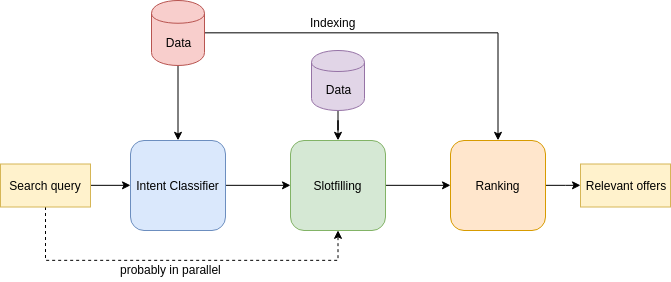

# Поиск по спецпредложениям

В мобильном приложении *Тинькофф* есть спецпредложения со скидками, и хочется находить по *нетривиальному* запросу самые *лучшие*.
Например, по запросу *где купить хороший велосипед со скидкой 30% кешбэка и до 60к* выдать наилучшее спецпредложение (см. [короткую презентацию](./reports/presentation/presentation.pdf)).

## Данные

В каталоге [`data`](./data) присутствуют два `xlsx` файла [`current_offers`](./data/current_offers.xlsx)
и [`offers_with_categories`](./data/offers_with_categories.xlsx). В файле [`current_offers`](./data/current_offers.xlsx)
содержаться данные по спецпредложениям (на 23 января 2019 года) со следующими полями:

- **NAME** - название организации, предоставляющее спецпредложение
- **WEB** - веб-сайт организации
- **CASH_BACK_HEIGHT** - кешбэк в процентах (если значение больше 100, то в рублях)
- **TRANCHE_STMT_COUNT** - длина рассрочки в месяцах
- **OFFER_TYPE** - тип спецпредложения (*STANDART* - кешбэк и *SPECIAL_CREDIT* - рассрочка)
- **ADVERT_TEXT** - описание спецпредложения

В файле [`offers_with_categories`](./data/offers_with_categories.xlsx):

- **OFFER_ID** - идентификационный номер спецпредложения
- **NAME** - название организации, предоставляющее спецпредложение
- **CASH_BACK_HEIGHT** - кешбэк в процентах (если значение больше 100, то в рублях)
- **TRANCHE_STMT_COUNT** - длина рассрочки в месяцах
- **OFFER_TYPE** - тип спецпредложения (*STANDART* или *SPECIAL_CREDIT*)
- **ADVERT_TEXT** - описание спецпредложения
- **CATEGORY_NAME** - категория спецпредложения

## План решения ~~или путь дата сатаниста~~

Поскольку задача звучит как **написать свой гугл за неделю**, введём некоторые ограничения, а именно будем искать только среди двух категориях *Спорт* и *Еда и продукты* и по ограниченному количеству услуг и товаров.

### Препроцессинг

Из сырых данных нужно отфильтровать данные по категориям и создать некоторые соответствия между спецпредложениями и веб-сайтами.

### Парсинг (**Data mining**)

Для каждого спецпредложения напарсить услуги и товары с веб-сайтов.

### Определение намерения (**Intent classification**)

Запрос *где купить хороший велосипед со скидкой 30% кешбэка и до 60к* скорее относится к категории *Спорт*, а не *Еда и продукты*, поэтому нужно понимать какой запрос к чему относится.

[кек](https://nlp.trenings.ru/blog/51-namerenie)

### Заполнение слотов (**Slotfilling**)

Из запроса *где купить хороший велосипед со скидкой 30% кешбэка и до 60к* нас скорее интересует *велосипед*, чем *купить* (хотя вдруг кто-то хочет продать, но это уже другая задача :) А также *30% кешбэк* и *до 60к*.

### Ранжирование (**Ranking**)

На основе важных слов (слотов) сформировать запрос в поисковик и вуаля, получить лучшее спецпредложение!

## Архитектура

- Несколько человек занимаются парсингом веб-сайтов из спецпредложений для сбора данных (*Data*) вида `(НАЗВАНИЕ_ТОВАРА, ОПИСАНИЕ, ДРУГИЕ_АТРИБУТЫ)` для классификации и индексации.
- Один человек отвечает за часть по обработке естественного языка (*Natural Language Processing (NLP)*), как классификация намерений (*Intent Classification*) и заполнение слотов (*Slotfilling*). 
- Один человек отвечает за построение индекса (*Indexing*) и ранжирования (*Ranking*).

## Полезные ссылки

Для парсинга на **python**'е:

- [Beautiful Soup](https://www.crummy.com/software/BeautifulSoup/bs4/doc/)
- [Scrapy](https://scrapy.org)

Для **slotfilling**'а:

- [Deeppavlov docs](http://docs.deeppavlov.ai/en/master/components/slot_filling.html)
- [Dialogflow docs](https://dialogflow.com/docs/concepts/slot-filling)

Для ранжирования с помощью библиотеки [Elasticsearch](https://www.elastic.co).

- [Elasticsearch tutorial for beginners using Python](https://towardsdatascience.com/elasticsearch-tutorial-for-beginners-using-python-b9cb48edcedc)
- [Getting started with ElasticSearch-Python :: Part Two](https://medium.com/the-andela-way/getting-started-with-elasticsearch-python-part-two-1c0c9d1117ea)
- [Python + Elasticsearch. First steps.](https://tryolabs.com/blog/2015/02/17/python-elasticsearch-first-steps/)
- [Twitter Sentiment Analysis – Python, Docker, Elasticsearch, Kibana](https://realpython.com/twitter-sentiment-python-docker-elasticsearch-kibana/)
- [Elastic docs](https://www.elastic.co/guide/en/elasticsearch/reference/current/query-dsl.html)

## Процесс работы

### День 1. 26.01.2019

Познакомились с командой и задачей. Распределили роли следующим образом:

- @KinGelaim и @ArtemBoyarintsev парсят веб-сайты
- @ameyuuno занимается классификацией намерений
- @NRshka занимается заполнением слотов
- Елизавета занимается индексацией и ранжированием

План на следующий день:

- [x] распарсить один сайт и посмотреть на данные (@KinGelaim и @ArtemBoyarintsev)
- [x] решить как генерить данные для классификации и слотфиллинга (@ameyuuno и @NRshka)
- [x] зафиксировать слоты (@NRshka)
- [x] накидать пайплайн всего процесса поиска, от запроса до выдачи

### День 2. 27.01.2019

Формат результата парсинга веб-сайтов:

- `Path`: полный путь к продукту (велосипеды ~ горный ~ Merida 500)
- `Description`: некоторое описание, если оно есть
- `Price`: стоимость продукта

Решили зафиксировать следующие слоты:

- `Item`: наименования товара (велосипед)
- `Attributes`: атрибуты (горный, детский, и т. д.)
- `Price_[from, to]`: стоимость как интервал от и до
- ~`installment` (под вопросом): рассрочка~
  - ~`is`: есть или нет~
  - ~`period`: на какое время~
  - ~`percent`: процент~
- `Cashback`: значение кешбэка

Написаны, но не протестированы слоты на правилах

- `Item`: наименования товара (велосипед)
- `Attributes`: атрибуты (горный, детский, и т. д.)
- `Price_[from, to]`: стоимость как интервал от и до
- `Cashback`: значение кешбэка

План на следующий день:

- [x] нагенерить данные для классификации и обучить простой классификатор (@ameyuuno)
- [x] протестировать работоспособность слотфиллера (@NRshka)
- [x] продолжить парсить сайты (@KinGelaim и @ArtemBoyarintsev)

### День 3. 28.01.2019

Зафиксированы сайты для спецпредложений для каждой из категорий *Спорт* [sport](./data/sport.xls) и *Еда и товары* [food](./data/food.xls). Эти файлы получены с помощью [merge](./data/merge.py). Также создан файл с пересекающимися спецпредложениями по категориям [intersect](./data/intersect.xls).

Появились данные по [*Спорт*](./data/sport) и [*Еда и продукты*](./data/food) по парсингу. Результатом парсинга является два файла `data.xls` и `meta.xls` и помещаются в папку с названием как сайт у спецпредложения. В `data.xls` хранится следующая информация:

- **Название**: полный путь к продукту (велосипеды ~ горный ~ Merida 500)
- **Описание**: некоторое описание, если оно есть
- **Цена**: стоимость продукта

В `meta.xls` хранится следующая информация:

- **NAME** - название организации, предоставляющее спецпредложение
- **WEB** - веб-сайт организации
- **CASH_BACK_HEIGHT** - кешбэк в процентах (если значение больше 100, то в рублях)
- **TRANCHE_STMT_COUNT** - длина рассрочки в месяцах
- **OFFER_TYPE** - тип спецпредложения (*STANDART* - кешбэк и *SPECIAL_CREDIT* - рассрочка)
- **ADVERT_TEXT** - описание спецпредложения

Первый прототип для классификации написан и проверен на простых примерах. На спарсенных трёх сайтах (два *Спорт* и один *Еда и товары*). Возникла проблема дисбаланса в сторону класса *Еда и товары*.

Также написан первый прототип для слотфиллинга и проверен на примерах, где товаром является *велосипед*. Для проверки на других примерах нужны названия всех имеющихся товаров и прочие атрибуты. Появится после парсинга сайтов.

План на следующий день:

- [x] прогнать некторые примеры через классификатор и слотфиллер

### День 4. 29.01.2019

Проверили классификатор и слотфиллер. Классификатору требуется больше данных. Слотфиллеру нужен словарь значений слотов и больше правил. Также добавили простой постпроцессинг к результату слотфиллера, например, все числа вида `60к` или `60 000` переводятся в `60000` для поисковика.

Парсить сайты стало утомительно. Решили остановиться на том, что успели.

Возможно, стоит перейти к нейросетевому слотфиллеру. Сгенерить данные на основе спарсенных слотов.

Елизавета предложила использовать сайт [e-katalog](http://www.e-katalog.ru) для поиска товаров. По выдаче товаров среди веб-сайтов искать спецпредложения.

План на следующий день:

- [ ] остановиться парсить сайты (@KinGelaim и @ArtemBoyarintsev)
- [ ] обернуть текущую реализацию слотфиллинга и запушить в общий пайплан (@NRshka)
- [ ] добавить модуль постпроцессинга слотов в корректный вид для поисковика (@NRshka)
- [x] начать писать поисковик (@ameyuuno)
- [ ] попробовать сгенерить данные для нейросетевого слотфиллера и обучить его
